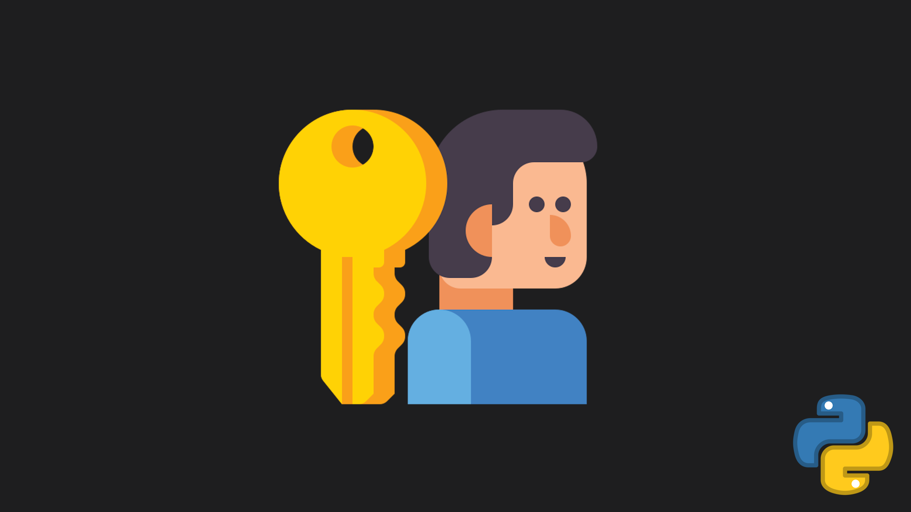

<h2 align="center">
  PYTHON Login Game API
</h2>

---

<div align="center">
  
</div>

<br/>

<div align="center">

[](https://forthebadge.com) &nbsp;
[](https://forthebadge.com) &nbsp;
[](https://forthebadge.com) &nbsp;

</div>

---

## About the Project

This project provides a **secure 3-tier authentication and game server architecture** for a **2D multiplayer RPG** built with Python.

The main goal is to **never expose the game server IP directly to clients**, preventing DDoS attacks by routing all connections through a REST API that handles authentication and server discovery.

The system is built with modularity in mind, making it easy to scale to multiple game servers, regions, and thousands of players.

---

## Architecture

```
Client (Pygame)
    │
    │  HTTPS  →  POST /login  →  JWT Token
    ▼
REST API (FastAPI)
    │
    │  Validates token, queries server list from MySQL
    ▼
MySQL Database
    │  Returns least loaded online server
    ▼
REST API  →  Returns IP + Port (only if token valid)
    │
    │  WebSocket (ws://)
    ▼
Game Server (asyncio + websockets)
    │  Verifies JWT on first message
    │  Accepts or closes connection
    ▼
Game Loop (move, combat, instances...)
```

---

## Features

* ✅ **Secure authentication** — JWT tokens with short expiry (2 min)
* ✅ **IP masking** — game server IP never exposed without valid token
* ✅ **Multi-server support** — dynamic server list stored in MySQL
* ✅ **Load balancing** — routes players to least loaded server
* ✅ **WebSocket game server** — real-time async communication
* ✅ **Player instance system** — per-player map instances with persistent builds
* ✅ **Bcrypt password hashing** — secure credential storage
* ✅ **FastAPI auto-docs** — Swagger UI available at `/docs`

---

## Project Structure

```
PYTHON-Login-Game-API/
├── code/
│   ├── api/
│   │   ├── main.py           # FastAPI entry point & routes
│   │   ├── auth.py           # Register & login logic
│   │   ├── jwt_handler.py    # JWT generation & validation
│   │   ├── database.py       # MySQL connection & table init
│   │   └── config.py         # Environment variables
│   │
│   ├── server/
│   │   ├── main.py           # WebSocket game server entry point
│   │   ├── game_loop.py      # Game logic (move, broadcast, etc.)
│   │   ├── player.py         # Player class
│   │   ├── jwt_verify.py     # Token verification
│   │   └── config.py         # Environment variables
│   │
│   └── client/
│       └── test_client.py    # Test script (login → connect → play)
│
├── .env                      # Environment variables (not committed)
├── .gitignore
└── README.md
```

---

## Installation

### 1 — Clone the repository

```bash
git clone https://github.com/Rudze/PYTHON-Login-Game-API.git
cd PYTHON-Login-Game-API
```

### 2 — Create a virtual environment

```bash
python -m venv .venv

# Windows
.venv\Scripts\activate

# Linux / macOS
source .venv/bin/activate
```

### 3 — Install dependencies

```bash
# API
pip install fastapi uvicorn PyMySQL python-jose[cryptography] bcrypt python-dotenv

# Game Server
pip install websockets python-jose python-dotenv

# Test client
pip install httpx websockets
```

### 4 — Configure environment variables

Create a `.env` file at the root of the project:

```env
DB_HOST=localhost
DB_PORT=3306
DB_USER=game_user
DB_PASSWORD=yourpassword
DB_NAME=game_db

JWT_SECRET=your_very_long_random_secret_key
JWT_EXPIRE_SECONDS=120

GAME_HOST=0.0.0.0
GAME_PORT=5000
```

### 5 — Setup MySQL

```sql
CREATE DATABASE game_db CHARACTER SET utf8mb4 COLLATE utf8mb4_unicode_ci;
CREATE USER 'game_user'@'%' IDENTIFIED BY 'yourpassword';
GRANT ALL PRIVILEGES ON game_db.* TO 'game_user'@'%';
FLUSH PRIVILEGES;
```

### 6 — Start the API

```bash
cd code/api
uvicorn main:app --reload --port 8000
```

Swagger UI available at: `http://localhost:8000/docs`

### 7 — Start the Game Server

```bash
cd code/server
python main.py
```

---

## API Routes

| Method | Route | Description | Auth required |
|--------|-------|-------------|---------------|
| POST | `/register` | Create a new account | No |
| POST | `/login` | Login and get a JWT token | No |
| GET | `/server-info` | Get the best available game server | Yes (Bearer token) |

---

## Example Use Cases

* 🎮 2D multiplayer RPG with base building and dungeons
* 🏰 Per-player persistent map instances
* 🌍 Multi-region server routing
* 🔐 Secure game backend with no exposed infrastructure

---

## Contact

If you have any questions, feel free to reach out at contact@rudydavid.fr

---

### Show Your Support

Give a ⭐ if you like this project!